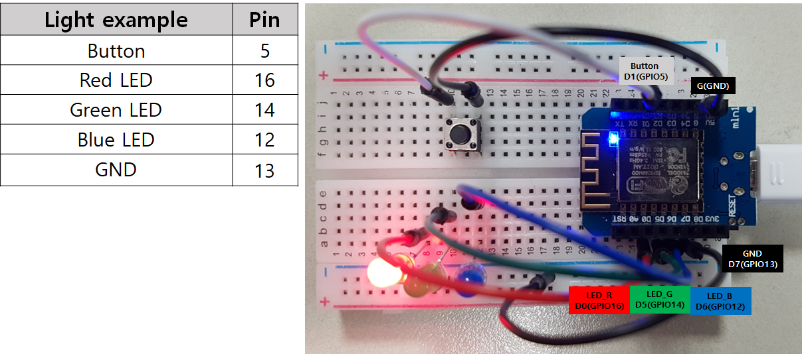
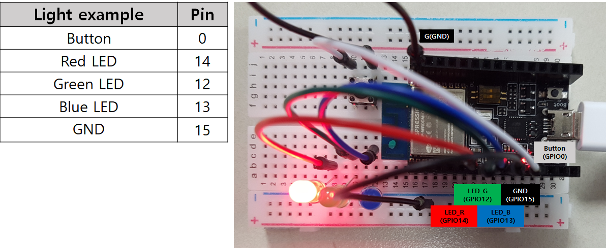

# SmartThings SDK for Direct Connected Devices for C - Light Example

## Introduction

SmartThings direct-connected device is Wi-Fi enabled device that uses the SmartThings cloud as its primary cloud infrastructure. And this device will use the MQTT protocol for communication.

## Getting started

For information on detailed workflow, please refer to the [Getting Started](https://github.com/SmartThingsCommunity/st-device-sdk-c-ref/blob/master/doc/getting_started.md)

## Components and Capabilities

SmartThings Device is defined using components and capabilities. Capabilities define the features of the device, and capabilities are grouped into components.
Components and Capabilities are contained in device profile. You can create a device profile in Developer Workspace and associate it with an integration.

This example assumes the following components and capabilities are used. :  

`main` component  
- `healthCheck` capability  
- `switch` capability  
- `switchLevel` capability  
- `colorTemperature` capability  
- `activityLightingMode` capability  

`monitor` component  
- `dustSensor` capability  

(`healthCheck` capability is automatically added by Developer Workspace. It doesn't need handler at device side)

## SmartThings SDK for Direct Connected Devices - Config
If you want to use specific SmartThings Device SDK build options, you can directly modify the build configuration file. For this example, SmartThings Device SDK config is saved in 'sdkconfig' file. If you want to change this, please execute the following :
```sh
# python build.py {app_path} {option}
$ cd ~/st-device-sdk-c-ref/
$ python build.py app/esp8266/light_example menuconfig
```

## Test device schematics
This example uses ESP32 GPIO like below.  
Please refer below pictures for __ESP8266-WEMOS D1 mini__ and __ESP8266-DEVKITC__.  
GPIOs for __ESP8266-WEMOS D1 mini__ will be used by default. You can switch it for __ESP8266-DEVKITC__ by uncommenting below `define` at [device_control.h](main/device_control.h)
```c
//#define CONFIG_TARGET_ESP8266_DEVKITC_V1
```

> Note: If your device's schematics doesn't match with belows.
> Please modify GPIO defines for your device at [device_control.h](main/device_control.h)
>
> ```c
> #define GPIO_INPUT_BUTTON 5
> 
> #define GPIO_OUTPUT_COLORLED_R 16
> #define GPIO_OUTPUT_COLORLED_G 14
> #define GPIO_OUTPUT_COLORLED_B 12
> #define GPIO_OUTPUT_COLORLED_0 13
> ```

### ESP8266-WEMOS D1 mini  
| ESP8266 WEMOS D1 mini                                                     |
|-------------------------------------------------------------------|
| |


### ESP8266-DEVKITC  
| ESP8266 DEVKITC                                                     |
|-------------------------------------------------------------------|
| |

